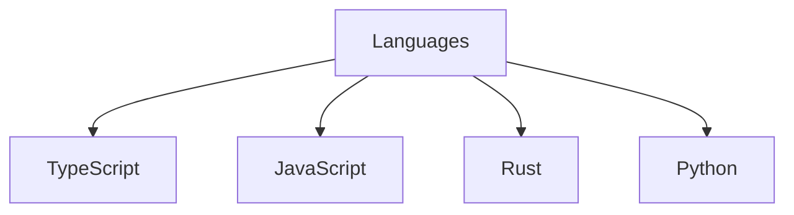
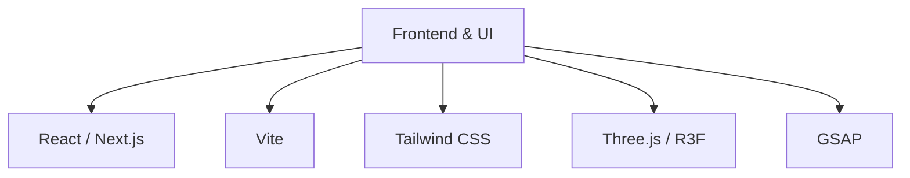
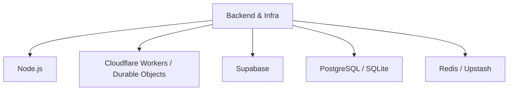
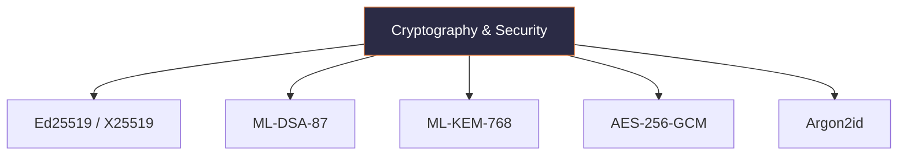
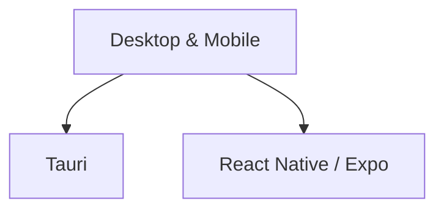
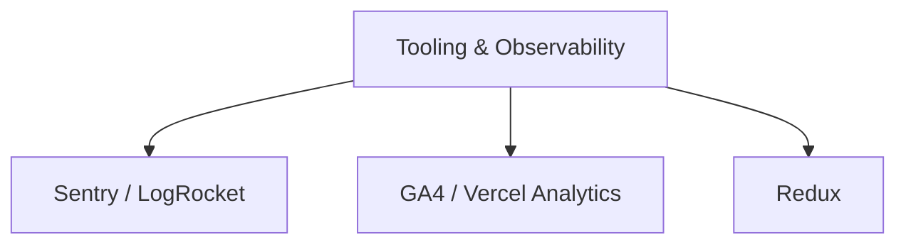

# Hey, I'm Zelijah 👋

> Building security-first software, developer tools, and cryptographic infrastructure.

I'm the Founder and Lead Software Engineer of **Majikah Solutions OPC**, a Philippine-registered company building a post-quantum cryptographic security ecosystem. I'm the sole developer across the entire stack — products, marketing site, developer tools, and business infrastructure.

---

## About Me

I work at the intersection of two identities:

- **[Majikah](https://majikah.solutions)** — my technical practice, focused on cryptography, secure communication, and developer experience.
- **[Maharlika](https://thezelijah.world/maharlika)** — an original alternate-history Filipino universe I created, spanning 3D art, music, lore, and collectible design.

Before founding Majikah, I spent a decade in the Philippine music industry (including work [with Sony Music Philippines](https://www.sonymusic.com.ph/artist/zelijah), with multiple credits and Awit Award nominations), worked in 3D animation and VFX, and taught 3D modelling and animation at [Meridian International College](https://mintcollege.com/). That mix of creative and technical experience directly shapes how I design and build products.

	

---

## Currently Building

**Majikah** — trust infrastructure for the next generation of the internet, all built on a shared cryptographic foundation called **Majik Key** (Ed25519, ML-DSA-87, ML-KEM-768, derived from a BIP-39 seed phrase).

| Product | Description |
|---|---|
| **Majik Message** | Real-time messaging with post-quantum-ready encryption |
| **Majik Signature** | File and text signing with Ed25519 + ML-DSA-87 |
| **Majik Universal ID (MUID)** | Self-sovereign cryptographic identity, with an embeddable verification widget |
| **Majik Buwiz** | Offline-first invoicing with signed records |
| **Majik SLink** | Cryptographic proof of ownership for websites and public profiles |
| **Majik SDKs** | Open-source TypeScript SDKs under the `@majikah` org |

---

## Company & Credentials

**[Majikah Solutions OPC](https://www.linkedin.com/company/majikah-solutions)** is a Philippine SEC-registered One Person Corporation (Reg. No. 2026050252036-01), currently **pre-seed**. Transparency matters to me, so I'd rather state that plainly than dress it up.

- 📄 IANA media type registration: `application/vnd.majikah.bundle` (`.mjkb`)
- ☁️ Google Cloud for Startups & Redis for Startups
- 🔒 SecurityScorecard rating: A / 93
- 📦 14 public npm packages under [`@majikah`](https://www.npmjs.com/org/majikah)

---

## Tech Stack

**Languages**

**Frontend & UI**

**Backend & Infrastructure**

**Cryptography & Security**

**Desktop & Mobile**

**Tooling & Observability**

---

## Areas of Interest

Cryptography · Cybersecurity · Distributed Systems · Cloud Infrastructure · Full-stack Development · Developer SDKs & APIs · Offline-first Applications · Desktop Applications · Product Architecture · Developer Experience (DX)

## Currently Exploring

Zero-Knowledge Technologies · Post-Quantum Security · Distributed Systems at scale · High-Performance Backend Architecture · Developer Experience

---

## Open Source

I enjoy building reusable SDKs, libraries, and developer tooling. Most of my open-source work is released under the **Apache 2.0 License** to encourage adoption while preserving attribution. Issues, feature requests, and discussions are always welcome.

---

## Connect

- 🌐 Majikah: [majikah.solutions](https://majikah.solutions)
- 🌐 Personal (Majikah + Maharlika): [thezelijah.world](https://thezelijah.world)
- 💼 LinkedIn: [linkedin.com/in/jedlsf](https://linkedin.com/in/jedlsf)
- ✉️ Business: business@thezelijah.world

### Your vision, my magic.

